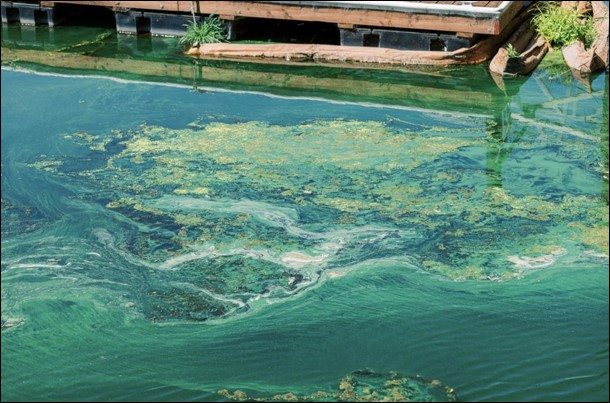
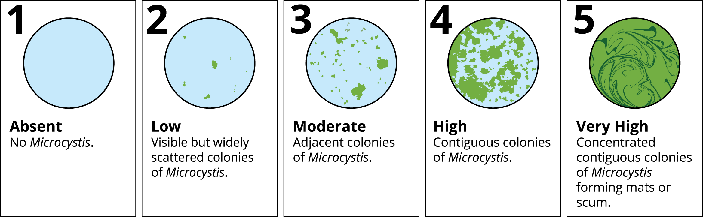

 
Spencer Fern, Ann Holmes, Shaela Noble, Emily Richardson, Nick Rowlands, [Michelle Stern](https://michelleastern.github.io/)

This work is supported by the [Delta Science Program in partnership with the National Center for Ecological Analysis and Synthesis](https://deltacouncil.ca.gov/delta-science-program/science-synthesis-working-group).

# What Are CHABs? 
Cyanobacterial Harmful Algal Blooms (CHABs) occur when cyanobacteria grow rapidly and accumulate in waterways. In the Sacramento–San Joaquin Delta, CHABs have been documented since 1999 and are becoming more frequent and severe. 

Algae and cyanobacteria are photosynthetic organisms that are foundational to aquatic food webs, however, some blooms become harmful: 
for example, some blooms produce toxins that disrupt food webs, deplete oxygen, create scum, and can affect water taste or odor. 

CHABs are frequently dominated by *Microcystis* species, which are of particular concern because some strains can produce microcystins, a group of potent liver toxins. These toxins can adversely affect humans, pets, livestock, and wildlife. 

Impacts occur via drinking water, irrigation water, recreational and subsistence fishing, recreation/water contact, potentially even inhalation via aerosolization of toxins. 

Not every *Microcystis* bloom produces toxins, and the level of risk is not always obvious from a bloom’s appearance. 

{width=750 alt="HAB"}

{width=750 alt="Microcystis Visual Index"}

[*Microcystis* Visual Index](https://doi.org/10.6084/m9.figshare.19239882), or MVI, was developed to help standardize CHAB bloom severity levels.

Keep an eye out: [California HAB Advisory Signs](https://mywaterquality.ca.gov/habs/resources/signage.html)

# Why CHABs Matter
• Risks to people, pets, and wildlife: Toxins such as microcystins can exceed advisory levels, prompting recreation warnings and restricting water use.

• Growing ecological impacts: Blooms influence nutrient dynamics, food webs, and habitat conditions.

• Increasing frequency: Environmental changes including temperature, hydrology, and nutrient inputs are driving more blooms across the Delta.

• Management relevance: CHABs complicate water operations, public communication, and long‑term planning.

# Key Gaps in CHAB Data and Models
Despite growing concern, our collective ability to monitor and predict CHABs remains limited:

• Incomplete monitoring: Current programs were not designed for CHABs, leaving gaps in location, frequency, and parameters measured.

• Data fragmentation: CHAB datasets are spread across agencies, researchers, and community groups, with no centralized platform for coordination or analysis.

• Sparse toxin and genetic data: Limited information on toxin levels and gene abundance prevents understanding toxicity patterns and health risks.

• Modeling limitations: Models lack the comprehensive data needed to link environmental conditions with bloom formation, toxicity, and regional variability.

# Why Synthesis and Coordination Are Needed
Across the Delta, CHAB‑related data are numerous but disconnected. Synthesis and coordination are essential because:

• Many groups collect valuable data, including satellite observations, water quality sampling, toxin analyses, research studies, and community science, but each holds only part of the picture.

• Without coordination, stakeholders lack visibility into what data exists, where they are stored, and how they can be used together.

• Integrated datasets are necessary to support trend analysis, modeling, visualization, public health responses, and management investments.

• Coordination ensures that data platforms can incorporate information from agencies, researchers, and community organizations, making them usable for diverse decision-making needs.

# The NCEAS CHABs Working Group
The Delta Science Program-coordinated NCEAS Synthesis Working Group represents a major step toward unifying CHAB efforts across the region. We are an interdisciplinary group of scientists who aim to:

• Catalog and integrate existing CHAB-related datasets.

• Design an accessible, publicly available, machine‑learning‑ready dataset.

• Coordinate with California state and national HAB efforts.

• Ensure community organizations are included through the Delta Stewardship Council’s Science for Communities initiative.

This work will enable better forecasting, clearer communication, and more effective mitigation strategies.

# Expected Outcomes
• Better data accessibility through coordinated platforms.

• Improved early warning and forecasting through more comprehensive models.

• Clearer, more timely public guidance during CHAB events.

• Stronger cross‑agency collaboration to protect ecosystem and community health.

# Current progress
• CHAB synthesis code in development: [https://github.com/Delta-Stewardship-Council/swg-26-chab](https://github.com/Delta-Stewardship-Council/swg-26-chab)

• Dr. Richardson published a ["chlorrectR" R package](https://github.com/etrichardson/chlorrectR) for correcting chlorophyll concentration data produced by fluorometers.

# Ongoing CHAB work
• [HAB Reports Map, CA Water Quality Monitoring Council](https://mywaterquality.ca.gov/habs/resources/reports-map/)

• [NOAA MERHAB](https://coastalscience.noaa.gov/science-areas/habs/merhab/)

• [Cyano Index and Chlorophyll index remotely sensed index visualization by SFEI](https://fhab.sfei.org/?p=cyano&c=10daymax&d=20260430)

• [Optimizing monitoring tools for cyanobacterial harmful blooms in the Sacramento-San Joaquin River Delta](https://sciencetracker.deltacouncil.ca.gov/activities/optimizing-monitoring-tools-cyanobacterial-harmful-blooms-sacramento-san-joaquin-river)

• [HABs Monitoring Strategy](https://deltacouncil.ca.gov/pdf/science-program/2024-10-21-final-delta-chabs-monitoring-strategy.pdf)

• [Delta Stewardship Council HABs performance measures](https://viewperformance.deltacouncil.ca.gov/pm/harmful-algal-blooms)

• [Freshwater and Estuarine Harmful Algal Bloom (FHAB) Program](https://www.waterboards.ca.gov/water_issues/programs/swamp/freshwater_cyanobacteria.html)

